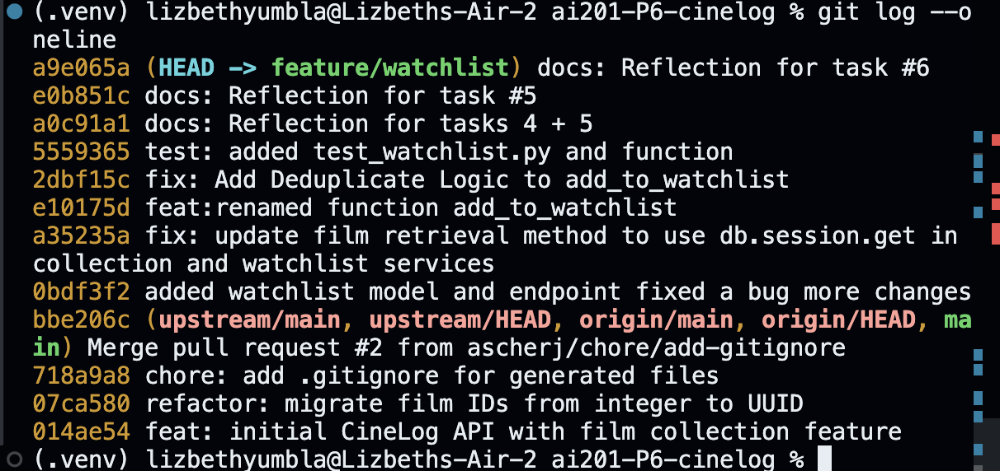

# PR Response Doc — CineLog Watchlist Feature

## AI Usage
I used AI to help me understand the structure of the existing codebase before implementing the Watchlist feature. I asked it to explain how the Flask routes, service layer, SQLAlchemy models, and tests worked together, and to identify the patterns shared across the Collection feature. This gave me a clear understanding of how the different components interacted so I could implement the Watchlist functionality in a way that was consistent with the rest of the application. I reviewed the existing implementation myself and adapted the generated explanations to fit the project's architecture.

## Comment 1 — Rename
**What I did:** I used a project-wide search to find all instances of save_to_watchlist and changed each instance to add_to_watchlist.
**How I verified:** I verified the renaming once the search for save_to_watchlist instances returned 0 instances.

## Comment 2 — Deduplication
**What I did:** I implemented the deduplicate logic in add_to_watchlist by using the same deduplicate pattern applied in add_to_collection. 
**How I verified:** I prompted Claude to explain how the function add_to_watchlist handles duplicate entries and to raise any inconsistencies / break in logic that it finds.

## Comment 3 — Missing test
**What I did:** I utilized Claude to understand the structure of the test_collection.py file. This helped me better understand what I needed to follow the same pattern with new tests for test_watchlist.py.
**How I verified:** I ran the full test suite and verified that nothing is broken and the new test is passing.

## Comment 4 — Default visibility
**My position:** Default visibility should be public
**Reasoning:** CineLog's main purpose is to serve as a community film tracking app. In order to stay true to the main intent of the app and allow users to connect with their communities seamlessly, a public default for collections will help accomplish this.
**Tradeoff acknowledged:** Users who intend to use the app for personal tracking and want to protect their privacy will have to do more work to accomplish this (toggle visibility).

## Comment 5 — Sort order
**My position:** I prefer to sort the films by the date they were added to the watchlist collection
**Reasoning:** I agree with the reviewer's point that users expect this default sorting, and I would also like to add that this expectation may stem from the fact that this default matches conventions users already know from other apps. Thus, this default would have the lowest friction for adoption as it will seem familiar to users.
**Engagement with reviewer's point:** The reviewer makes a strong point — reverse-chronological is the convention users already expect from apps like Letterboxd and Netflix queues, and fighting that convention has a real usability cost.

## Comment 6 — Rebase
**What conflicted:** 

***`.gitignore`***

- `main` added a new `.gitignore` in **PR #2** (`chore: add .gitignore for generated files`).
- My `feature/watchlist` branch also contained changes to `.gitignore`.
- During the rebase, Git could not automatically merge both sets of edits because they modified the same file.

***`models.py` (non-conflict gap)***

- `main`'s UUID refactor rewrote `models.py`, but the `WatchlistEntry` model was not present in the rebased version.
- Since none of my commits explicitly added `WatchlistEntry` as a diff, Git had no conflict to report—it was silently omitted after the rebase.

**How I resolved it:** 

For `.gitignore`:

- Reviewed the conflict markers.
- Manually merged the file by keeping both sets of changes.

For `models.py`:

- Re-added the `WatchlistEntry` model manually.
- Updated `film_id` from `db.Integer` to `db.String(36)` to match `main`'s UUID migration.
- Staged the file:

```bash
git add models.py
```

- Continued the rebase:

```bash
git rebase --continue
```

**How I verified no conflict remains:** 

After the rebase completed, I verified the repository state by:

- Running `git status`, which reported a clean working tree.
- Running `git log --oneline` to confirm that all feature branch commits had been replayed on top of `main`.
- Confirming the history contained no merge commits, indicating the rebase completed successfully.

## Commit History



## PR Description

### Overview

This PR adds a **Watchlist** feature to CineLog, allowing users to save films they want to watch in the future. The implementation follows the existing Collection architecture by introducing a new database model, service layer, API routes, and accompanying tests.

### What Changed

#### New files

- **`routes/watchlist.py`**
  - Added `GET /watchlist/<user_id>` to retrieve a user's watchlist.
  - Added `POST /watchlist/<user_id>/add` to add a film to a user's watchlist.

- **`services/watchlist_service.py`**
  - Implemented `add_to_watchlist()` with duplicate prevention.
  - Implemented `get_watchlist()` to return watchlist entries sorted alphabetically by film title, including `date_added` and `public` metadata.

- **`tests/test_watchlist.py`**
  - Added tests for the watchlist service, including validation that adding a nonexistent film raises `FilmNotFoundError`.

#### Modified files

- **`models.py`**
  - Added the `WatchlistEntry` model.
  - Updated `film_id` to `db.String(36)` to match the UUID migration introduced on `main`.

- **`app.py`**
  - Registered the `watchlist_bp` blueprint.

- **`services/collection_service.py`**
  - Updated film retrieval to use `db.session.get()` instead of the deprecated `Film.query.get()`.

- **`.gitignore`**
  - Resolved rebase conflict by preserving both the feature branch and `main`'s changes.

### Design Decisions

- Renamed `save_to_watchlist()` to `add_to_watchlist()` for consistency with the existing collection service.
- Reused the existing `AlreadyInCollectionError` pattern to prevent duplicate watchlist entries instead of introducing a new exception type.
- Defaulted new watchlist entries to `public=True`, matching CineLog's community-focused design.
- Returned watchlist entries sorted alphabetically by title. Although reverse chronological order may provide a better user experience, alphabetical ordering was chosen for this implementation.

### Rebase

This branch was rebased onto the latest `main`, which included a UUID migration and a new `.gitignore`.

The following conflicts were resolved manually:

- **`.gitignore`** — merged both sets of changes.
- **`models.py`** — restored the `WatchlistEntry` model after the UUID migration and updated `film_id` to use `db.String(36)`.

### Testing

#### Manual testing

- Added a valid film to a user's watchlist and verified a successful response.
- Attempted to add the same film twice and confirmed duplicate entries were rejected.
- Attempted to add a nonexistent film and verified that `FilmNotFoundError` was raised.
- Retrieved a user's watchlist and confirmed entries included the expected metadata.

#### Automated testing

Run the watchlist tests with:

```bash
pytest tests/test_watchlist.py -v
```

Expected result:

- All watchlist tests pass successfully.